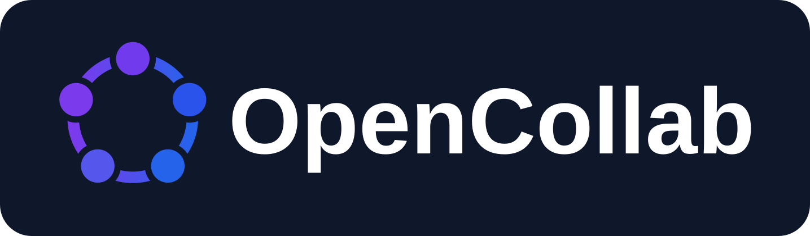
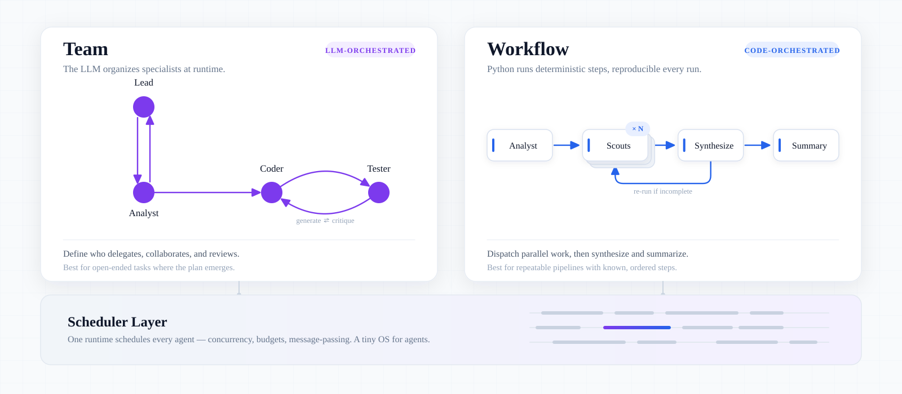

<p align="center">
  
</p>

<p align="center">
  <a href="https://github.com/RISE-X-Lab/OpenCollab/actions/workflows/ci.yml"></a>
  <a href="https://github.com/RISE-X-Lab/OpenCollab/blob/main/LICENSE"></a>
  
  <a href="https://github.com/RISE-X-Lab/OpenCollab/blob/main/assets/README.md"></a>
</p>

<p align="center">
  <b>An Operating Theory of Organized Intelligence.</b>
</p>

<p align="center">
  OpenCollab is inspired by <a href="https://arxiv.org/abs/2304.07590" title="Self-collaboration Code Generation via ChatGPT — Dong, Jiang, Jin, Li (2023)"><b>Self-Collaboration</b></a>.
</p>

## What you can run

<p align="center">
  <picture>
    <source srcset="assets/oc-hero-dark.svg" media="(prefers-color-scheme: dark)">
    <source srcset="assets/oc-hero-light.svg" media="(prefers-color-scheme: light)">
    
  </picture>
</p>

OpenCollab supports two forms of collaboration on the same agent runtime.

| Mode | Command | What it is |
| --- | --- | --- |
| **Team** | `opencollab [--team-config FILE] --workspace .` | A lead plans the work and spawns specialists that collaborate until the task is done. The agents decide the division of labor. |
| **Workflow** | `opencollab workflow run NAME` | Python defines fan-out, pipeline, loop, and verification behavior while agents complete each step. |

Model access, context handling, tool execution, orchestration, and environments
have separate extension points. An experiment can change one component at a
time.

New collaboration designs can reuse this runtime and live in a small team file
and workflow.

[Edict](https://github.com/cft0808/edict) implements the Three
Departments and Six Ministries as a standalone system with roughly 24,000
source lines. [Mini Edict](examples/mini-edict/) implements Edict's core
review-and-dispatch protocol in 239 lines of team and workflow code on the
OpenCollab runtime. The example includes a bilingual guide and tests.

## Quick start

```bash
uv sync --locked
cp configs/.env.example configs/.env   # then set OPENCOLLAB_API_KEY
uv run opencollab --workspace .
```

Point `configs/.env` at an OpenAI-compatible or Anthropic endpoint. The command
starts with the built-in single `lead`, which may spawn ad-hoc specialists.
Never commit real API keys. To use declared roles and a fixed topology, select a
team file explicitly.

```bash
cp configs/team.example.yaml configs/team.yaml
uv run opencollab --team-config configs/team.yaml --workspace .
```

For repeatable pipelines, author a Python workflow and run it by name.

```bash
uv run opencollab workflow run NAME --args '{"task": "..."}'
```

See [Workflow authoring](https://github.com/RISE-X-Lab/OpenCollab/blob/main/opencollab/README.md#workflow-authoring)
for a complete module.

## Evaluate with OpenCollab-Eval

[OpenCollab-Eval](https://github.com/RISE-X-Lab/OpenCollab-Eval) is a downstream
application built on OpenCollab's public Python API. It exercises agents, teams,
workflows, tools, and environments from outside this repository.

OpenCollab-Eval runs agents on software-engineering benchmarks. It creates an
isolated workspace for each task and records the Solver's patch. It then runs
the official tests and keeps the commands and reports needed to inspect the
result. It currently supports SWE-bench Pro-Lite and provides a generic task
runner for other evaluation workloads.

Datasets, Docker integration, benchmark adapters, experiment reports, and their
execution records live in OpenCollab-Eval. This repository contains the
collaboration framework.

The [evaluation guide](https://github.com/RISE-X-Lab/OpenCollab-Eval#supported-environment)
explains how to run it. The [integrity guide](https://github.com/RISE-X-Lab/OpenCollab-Eval/blob/main/docs/evaluation-integrity.md)
explains how results are checked. [MIGRATION.md](https://github.com/RISE-X-Lab/OpenCollab-Eval/blob/main/MIGRATION.md)
records the boundary between the repositories.

## Documentation

The [package guide](https://github.com/RISE-X-Lab/OpenCollab/blob/main/opencollab/README.md)
covers installation, the CLI, the Python API, architecture, and runtime
behavior. The [configuration guide](https://github.com/RISE-X-Lab/OpenCollab/blob/main/configs/README.md)
covers providers, models, and teams.

[Mini Edict](https://github.com/RISE-X-Lab/OpenCollab/tree/main/examples/mini-edict)
shows a nine-role institutional workflow. The [skills guide](https://github.com/RISE-X-Lab/OpenCollab/blob/main/skills/README.md)
documents on-demand instructions. The [scripts guide](https://github.com/RISE-X-Lab/OpenCollab/blob/main/scripts/README.md)
documents launchers and provider diagnostics.

Repository development is documented in [CONTRIBUTING.md](https://github.com/RISE-X-Lab/OpenCollab/blob/main/CONTRIBUTING.md).
Maintainers can follow [RELEASING.md](https://github.com/RISE-X-Lab/OpenCollab/blob/main/RELEASING.md)
when preparing a release.
The [documentation index](https://github.com/RISE-X-Lab/OpenCollab/blob/main/docs/README.md)
links design records and research notes. Benchmark users should begin with the
[OpenCollab-Eval README](https://github.com/RISE-X-Lab/OpenCollab-Eval#readme).

## License

OpenCollab is licensed under the [Mulan Permissive Software License v2](https://github.com/RISE-X-Lab/OpenCollab/blob/main/LICENSE)
(`MulanPSL-2.0`).
