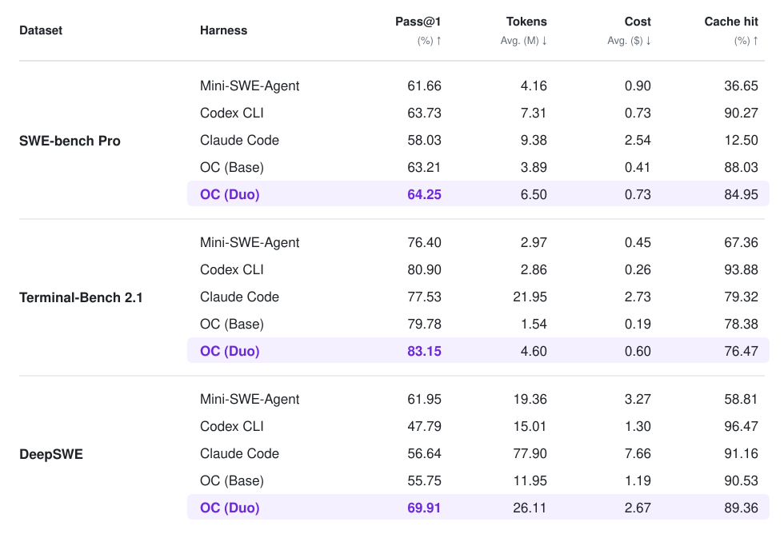
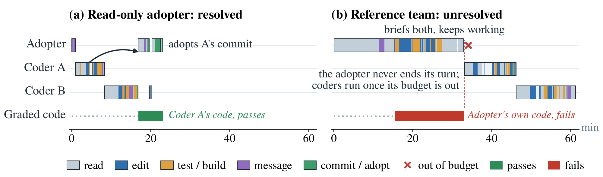
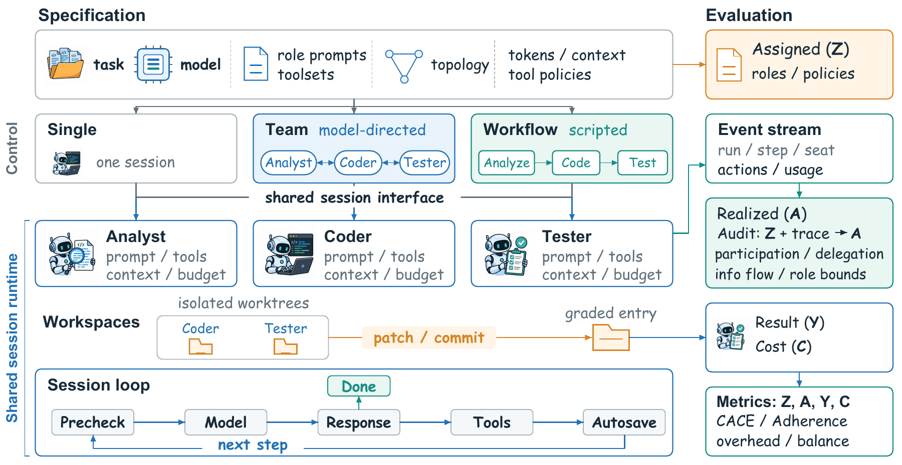

<p align="center">
  
</p>

<p align="center">
  <a href="https://github.com/RISE-X-Lab/OpenCollab/actions/workflows/ci.yml"></a>
  <a href="https://github.com/RISE-X-Lab/OpenCollab/releases/latest"></a>
  <a href="https://github.com/RISE-X-Lab/OpenCollab/blob/main/LICENSE"></a>
  
  <a href="https://github.com/RISE-X-Lab/OpenCollab/blob/main/assets/README.md"></a>
  <a href="https://github.com/RISE-X-Lab/OpenCollab"></a>
</p>

<h3 align="center">Program how coding agents collaborate. Verify that they did.</h3>

<p align="center">
  A multi-agent coding framework with programmable collaboration and a controllable runtime.<br>
  Inspired by <a href="https://arxiv.org/abs/2304.07590" title="Self-collaboration Code Generation via ChatGPT — Dong, Jiang, Jin, Li (2023)"><b>Self-Collaboration</b></a>.
</p>

<p align="center">
  <b>English</b> · <a href="README.zh-CN.md">Chinese</a>
  <br>
  <a href="#benchmark-results">Results</a> ·
  <a href="#does-your-team-actually-collaborate">Adherence</a> ·
  <a href="#how-it-works">How it works</a> ·
  <a href="#quick-start">Quick start</a> ·
  <a href="docs/duo.md">Duo</a> ·
  <a href="https://github.com/RISE-X-Lab/OpenCollab-Eval">OpenCollab-Eval</a>
</p>

<p align="center">
  <picture>
    <source media="(prefers-color-scheme: dark)" srcset="assets/benchmark-hero-dark.svg">
    
  </picture>
</p>

<table>
  <tr>
    <td width="50%" valign="top">
      <h4>🏆 Highest Pass@1 with the same model</h4>
      With GPT-5.6-Luna in every harness, OpenCollab (Duo) beats Claude Code,
      Codex CLI, and Mini-SWE-Agent on SWE-bench Pro, Terminal-Bench 2.1, and
      DeepSWE.
    </td>
    <td width="50%" valign="top">
      <h4>💰 The cheapest harness in the comparison</h4>
      OpenCollab (Base), the single agent, uses the fewest tokens and costs the
      least on all three benchmarks. Duo costs less than Claude Code on each of
      them.
    </td>
  </tr>
  <tr>
    <td width="50%" valign="top">
      <h4>🧩 Collaboration as code</h4>
      Declare roles, tools, and who may message whom in a YAML team file, or
      script every handoff in Python. <a href="examples/mini-edict/">Mini Edict</a>
      reproduces the core protocol of a roughly 24,000-line multi-agent system
      in 239 lines.
    </td>
    <td width="50%" valign="top">
      <h4>🔍 Collaboration you can check</h4>
      Every model call, tool call, message, and refusal lands in a role-stamped
      event stream. From it we measure <b>Adherence</b>, the share of runs in
      which the declared organization actually happened. Changing one setting
      moved it from 47.2% to 97.2%.
    </td>
  </tr>
</table>

## News

- **2026-09** — Our paper, *OpenCollab: A Multi-Agent Coding Framework with
  Programmable Collaboration and Controllable Runtime*, is coming soon.
- **2026-09-27** — [OpenCollab 0.8](https://github.com/RISE-X-Lab/OpenCollab/releases/tag/v0.8.0)
  ships [Duo](docs/duo.md), a built-in dual-coder workflow, and makes
  [Single2](docs/single2.md) the default Base agent.
- 🎉 **Congratulations!** OpenCollab has been selected for support by the
  **Seed Program of the Youth Open Source Special Fund**.

## Benchmark results

The full comparison adds average tokens, estimated average cost, and cache hit
rate. All five harnesses run GPT-5.6-Luna at `max` reasoning effort on
SWE-bench Pro (193 tasks), Terminal-Bench 2.1 (89 tasks), and DeepSWE
(113 tasks). [OC (Base)](docs/single2.md) is a single agent.
[OC (Duo)](docs/duo.md) produces two isolated solutions, compares their
evidence, and adopts one.

<p align="center">
  <picture>
    <source media="(prefers-color-scheme: dark)" srcset="assets/benchmark-results-dark.svg">
    
  </picture>
</p>

> [!TIP]
> **When collaboration is guaranteed, the team beats its own single agent.**
> Duo is a Workflow: its code issues every handoff, so both coders work on
> every task. Paired task by task with Base on DeepSWE, Duo solves 21 tasks
> that Base fails and fails 5 that Base solves, a gain of 14.2 points (exact
> sign test, p = 0.0025). On Terminal-Bench 2.1 the gain is 3.4 points.[^tb]

## Does your team actually collaborate?

Give agents the roles of analyst, coder, and tester, and a benchmark score
still reports only the final outcome. It does not say whether the agents
worked together. In OpenCollab's traces they often did not: the lead agent
briefed its teammates and then did the work itself, or spent its whole token
budget before handing anything off. The declared team collapsed into a single
agent. We call this the *illusion of collaboration*.

<p align="center">
  
</p>
<p align="center">
  <sub>Two runs reconstructed from OpenCollab's event stream. (a) With read-only tools, the Adopter
  (the lead agent) hands the task to the coders and adopts Coder A's commit. (b) In the reference team,
  the Adopter briefs both coders but keeps working until its budget runs out, so its own code is graded.</sub>
</p>

We turn this into a number. A run counts as adherent only if its
trace shows that every declared role took part and that delegation, role
boundaries, budget sharing, information flow, and context policy all held.
**Adherence** is the share of adherent runs. On 36 SWE-bench Pro tasks, one
change to the same team moves it a long way:

| Change to the reference team | Adherence |
| --- | ---: |
| None (Qwen3.8-Flash, open prompt, all tools, star topology) | 47.2% |
| The prompt makes the handoff mandatory | 91.7% |
| The lead agent gets read-only tools | 94.4% |
| Every role runs GPT-5.6-Luna | 97.2% |

Adherence tells you how to read a Team-versus-Single gap. Dividing the Pass@1
difference by Adherence gives the complier average causal effect (CACE), and
because Adherence is recorded for every run, the assumption behind that
estimate can be examined with data rather than assumed. The paper defines the
six audit axes and reports the full ablation over model, tools, budget,
context, and topology.

## How it works

### Collaboration as code

<p align="center">
  <picture>
    <source srcset="assets/oc-hero-dark.svg" media="(prefers-color-scheme: dark)">
    <source srcset="assets/oc-hero-light.svg" media="(prefers-color-scheme: light)">
    
  </picture>
</p>

OpenCollab supports two forms of collaboration on the same agent runtime, next
to a single-agent baseline.

| Mode | Command | What it is |
| --- | --- | --- |
| **Team** | `opencollab [--team-config FILE] --workspace .` | A lead plans the work and spawns specialists that collaborate until the task is done. The agents decide the division of labor. |
| **Workflow** | `opencollab workflow run NAME` | Python defines fan-out, pipeline, loop, and verification behavior while agents complete each step. |

A team file declares each role's prompt, model, and tools, and a topology of
who may message whom. A workflow is a Python module, so every handoff is
explicit code.

A substantial collaboration design becomes a compact, readable protocol.
[Edict](https://github.com/cft0808/edict) implements the Three Departments and
Six Ministries as a standalone system with roughly 24,000 source lines.
[Mini Edict](examples/mini-edict/) implements Edict's core review-and-dispatch
protocol in 239 lines of team and workflow code on the OpenCollab runtime,
roughly a hundredfold reduction. Researchers describe the collaboration
protocol, and OpenCollab provides the infrastructure that runs it. The example
includes a bilingual guide and tests.

### One controlled runtime

<p align="center">
  
</p>

- **One substrate for every organization.** Single agents, Teams, and
  Workflows run on the same session runtime, with the same model client,
  context handling, and tool implementations. Changing the organization does
  not change the rest of the system. Model access, context handling, tool
  execution, orchestration, and environments have separate extension points,
  so an experiment can change one component at a time.
- **Rules enforced at call time.** A message along an undeclared edge is
  refused, and the refusal is recorded. Each agent's token budget is checked
  before every model call, and an agent that reaches its ceiling stops with an
  explicit reason, so a run cut short is never confused with one that finished.
- **An event stream instead of prose logs.** `--trace` writes one JSONL record
  per step, stamped with the run, agent, role, event type, and token usage.
  Scripts can rebuild who did what without parsing chat transcripts.
- **Isolated workspaces.** Teammates can work in their own git worktrees and
  hand back their diffs.

## Quick start

```bash
uv sync --locked
cp configs/.env.example configs/.env   # then set OPENCOLLAB_API_KEY
uv run opencollab --workspace .
```

Point `configs/.env` at an OpenAI-compatible or Anthropic endpoint. The command
starts with the built-in single `lead`, which may spawn ad-hoc specialists.
Never commit real API keys. To use declared roles and a fixed topology, select a
team file explicitly.

```bash
cp configs/team.example.yaml configs/team.yaml
uv run opencollab --team-config configs/team.yaml --workspace .
```

Run [Duo](docs/duo.md), the built-in dual-coder workflow, in a local Git
repository. Its two isolated coders compare public evidence and apply a
selected patch. Local shell execution is an explicit workflow input.

```bash
uv run opencollab workflow list --workspace /path/to/repository
uv run opencollab workflow run duo --workspace /path/to/repository \
  --args '{"goal":"Fix the public issue described here.","allow_unisolated_shell":true}'
```

The [Duo guide](docs/duo.md) covers SDK calls, the Single2 profile, the explicit
complete file evidence, and task-oriented role instructions.
The [Chinese guide](docs/duo/README.zh-CN.md) is available alongside the canonical guide.
See [Workflow authoring](https://github.com/RISE-X-Lab/OpenCollab/blob/main/opencollab/README.md#workflow-authoring)
to define another collaboration protocol as a Python module.

## Evaluate with OpenCollab-Eval

[OpenCollab-Eval](https://github.com/RISE-X-Lab/OpenCollab-Eval) runs agents on
software-engineering benchmarks through OpenCollab's public Python API. It
creates an isolated workspace for each task, records the patch, runs the
official tests, and keeps the commands and reports needed to inspect the
result. It currently supports SWE-bench Pro-Lite and provides a generic task
runner for other evaluation workloads. Datasets, Docker integration, benchmark
adapters, and experiment reports live there; this repository contains the
collaboration framework.

The default [OC Base agent](docs/single2.md) maps to Single2 through the public
`agent(...)` entry. For a complete collaborative evaluation, follow the
[Duo with Single2 quick start](https://github.com/RISE-X-Lab/OpenCollab-Eval#duo-quick-start).
It covers matching OC/OCE 0.8 installations, benchmark images, a Responses
model endpoint, and one-task official evaluation with
`oc-eval g22 --config /path/to/g22.json --indices 1 --workers 1`.
The same configuration runs a batch and keeps per-task patches, trajectories,
and official test reports together.

The [evaluation guide](https://github.com/RISE-X-Lab/OpenCollab-Eval#supported-environment)
explains how to run it. The [integrity guide](https://github.com/RISE-X-Lab/OpenCollab-Eval/blob/main/docs/evaluation-integrity.md)
explains how results are checked. [MIGRATION.md](https://github.com/RISE-X-Lab/OpenCollab-Eval/blob/main/MIGRATION.md)
records the boundary between the repositories.

## Documentation

The [package guide](https://github.com/RISE-X-Lab/OpenCollab/blob/main/opencollab/README.md)
covers installation, the CLI, the Python API, architecture, and runtime
behavior. The [configuration guide](https://github.com/RISE-X-Lab/OpenCollab/blob/main/configs/README.md)
covers providers, models, and teams.

[Mini Edict](https://github.com/RISE-X-Lab/OpenCollab/tree/main/examples/mini-edict)
shows a nine-role institutional workflow. The [skills guide](https://github.com/RISE-X-Lab/OpenCollab/blob/main/skills/README.md)
documents on-demand instructions. The [scripts guide](https://github.com/RISE-X-Lab/OpenCollab/blob/main/scripts/README.md)
documents launchers and provider diagnostics.

Repository development is documented in [CONTRIBUTING.md](https://github.com/RISE-X-Lab/OpenCollab/blob/main/CONTRIBUTING.md).
The [testing guide](docs/testing.md) covers suite commands and the
[test directory guide](tests/README.md) maps behavior to test topics.
Maintainers can follow [RELEASING.md](https://github.com/RISE-X-Lab/OpenCollab/blob/main/RELEASING.md)
when preparing a release.
The [documentation index](https://github.com/RISE-X-Lab/OpenCollab/blob/main/docs/README.md)
links design records and research notes. Benchmark users should begin with the
[OpenCollab-Eval README](https://github.com/RISE-X-Lab/OpenCollab-Eval#readme).

## Citation

If you find this project useful, please consider giving it a ⭐ and citing our
work. Our paper, *OpenCollab: A Multi-Agent Coding Framework with Programmable
Collaboration and Controllable Runtime*, is coming soon. OpenCollab builds on
Self-Collaboration:

```bibtex
@article{dong2023self,
  author={Dong, Yihong and Jiang, Xue and Jin, Zhi and Li, Ge},
  title        = {Self-Collaboration Code Generation via ChatGPT},
  journal      = {ACM Transactions on Software Engineering and Methodology},
  volume       = {33},
  number       = {7},
  pages        = {189:1--189:38},
  year         = {2024}
}
```

## License

OpenCollab is licensed under the [Mulan Permissive Software License v2](https://github.com/RISE-X-Lab/OpenCollab/blob/main/LICENSE)
(`MulanPSL-2.0`).

## Star History

<p align="center">
  <a href="https://www.star-history.com/?repos=RISE-X-Lab%2FOpenCollab&amp;type=date">
    <picture>
      <source media="(prefers-color-scheme: dark)" srcset="https://api.star-history.com/svg?repos=RISE-X-Lab/OpenCollab&amp;type=Date&amp;theme=dark">
      
    </picture>
  </a>
</p>

[^tb]: On Terminal-Bench 2.1, the difference rests on 6 tasks that only Duo
    solves and 3 that only Base solves, and it is not statistically significant
    (p = 0.51). Passes on that benchmark that used leaked reference material were
    withdrawn or replaced by a fresh run before scoring.
