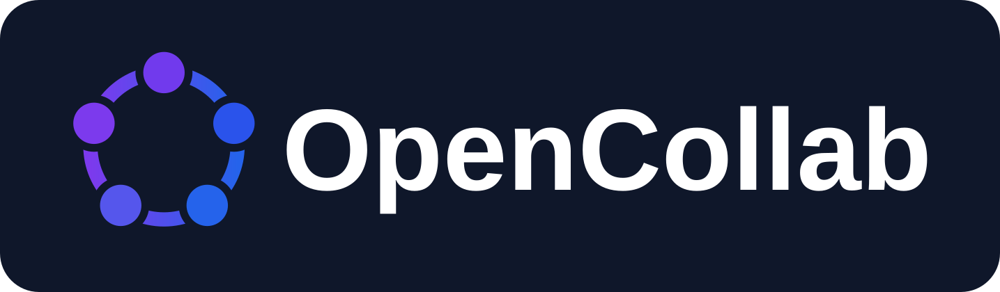
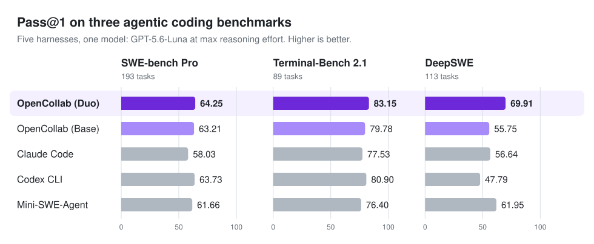
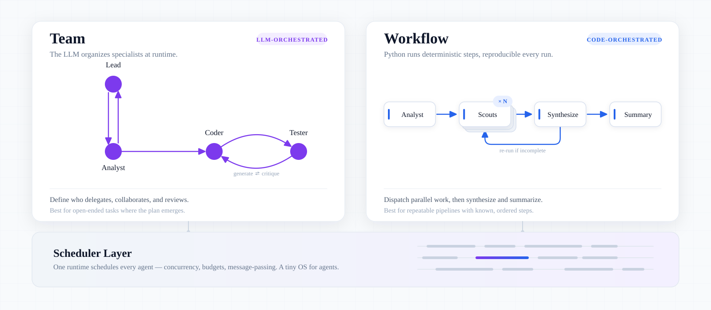

<p align="center">
  
</p>

<p align="center">
  <a href="https://github.com/RISE-X-Lab/OpenCollab/actions/workflows/ci.yml"></a>
  <a href="https://github.com/RISE-X-Lab/OpenCollab/releases/latest"></a>
  <a href="https://github.com/RISE-X-Lab/OpenCollab/blob/main/LICENSE"></a>
  
</p>

<h3 align="center">用代码编排 coding agent 的协作，用运行记录验证协作确实发生。</h3>

<p align="center">
  OpenCollab 是一个多智能体编程框架。它让每一种协作都跑在同一个受控的 runtime 上，
  并记录协作是否真的发生。
  <br>
  <a href="README.md">English</a> · <b>简体中文</b>
</p>

<p align="center">
  <picture>
    <source media="(prefers-color-scheme: dark)" srcset="assets/benchmark-hero-dark.svg">
    
  </picture>
</p>
<p align="center">
  <sub>Duo 生成两个相互隔离的解，采纳其中一个。Base 是单 agent，token 用量在五个 harness 里最少。
  <a href="docs/results.md">完整结果（英文）</a></sub>
</p>

## 动态

- **2026-09**：论文 *OpenCollab: A Multi-Agent Coding Framework with
  Programmable Collaboration and Controllable Runtime* 即将公开。
- **2026-09-27**：[OpenCollab 0.8](https://github.com/RISE-X-Lab/OpenCollab/releases/tag/v0.8.0)
  发布，内置 [Duo](docs/duo/README.zh-CN.md)，默认的 Base agent 改为
  [Single2](docs/single2.md)。
- 🎉 **祝贺！** OpenCollab 入选 **Seed Program of the Youth Open Source Special Fund** 资助。

## 快速开始

```bash
uv sync --locked
cp configs/.env.example configs/.env   # 然后设置 OPENCOLLAB_API_KEY
uv run opencollab --workspace .
```

`configs/.env` 可以指向任何 OpenAI 兼容端点或 Anthropic 端点；不要提交真实的 API key。
这条命令启动内置的 `lead` agent，它可以按需派生专职 agent。在一个 Git 仓库上运行 Duo：

```bash
uv run opencollab workflow run duo --workspace /path/to/repository \
  --args '{"goal":"Fix the public issue described here.","allow_unisolated_shell":true}'
```

## 用代码编排协作

<p align="center">
  <picture>
    <source srcset="assets/oc-hero-dark.svg" media="(prefers-color-scheme: dark)">
    <source srcset="assets/oc-hero-light.svg" media="(prefers-color-scheme: light)">
    
  </picture>
</p>

- **Team。** 把 [`configs/team.example.yaml`](configs/team.example.yaml) 复制为
  `configs/team.yaml`，在里面声明每个角色的 prompt、模型和工具，以及谁可以给谁发消息，然后运行
  `uv run opencollab --team-config configs/team.yaml --workspace .`
- **Workflow。** 把交接写成一个 Python 模块（见
  [Workflow authoring](opencollab/README.md#workflow-authoring)），用
  `uv run opencollab workflow run NAME` 运行。Duo 就是一个内置的 workflow。

[Mini Edict](examples/mini-edict/) 用 239 行 team 与 workflow 代码重新实现了
[Edict](https://github.com/cft0808/edict) 的核心协议，而 Edict 是一个约 24,000 行的多智能体系统。

## 验证协作确实发生

在 Team 里，交接由 agent 自己决定，声明了团队并不保证交接真的发生。在我们的运行里，
lead agent 常常给队友布置完任务后自己把活干了。OpenCollab 强制执行声明，并记录每个 agent 做了什么：

- 沿未声明的边发送的消息会被拒绝，拒绝本身也会被记录；
- 每次模型调用前都会检查该 agent 的 token 预算；
- `--trace` 为每一步写一条 JSONL 记录，带有 run、agent、角色、事件类型和 token 用量。

我们根据这些记录计算 **Adherence**：声明的组织在多少比例的 run 里真的发生了。
对同一个团队只改一个设置，它就从 47.2% 升到最高 97.2%。
详见 [Adherence 的测量方法](docs/adherence.md)（英文）。

## 更多文档

| 文档 | 内容 |
| --- | --- |
| [包指南](opencollab/README.md) | CLI、Python API、架构与运行时行为 |
| [配置指南](configs/README.md) | provider、模型与 team 文件 |
| [Duo 中文指南](docs/duo/README.zh-CN.md) · [English](docs/duo.md) | 从 CLI 和 SDK 运行双 coder workflow |
| [评测结果](docs/results.md) | token、花费、Duo 与 Base 的逐题配对检验，以及如何跑评测 |
| [Adherence](docs/adherence.md) | runtime 记录了什么，以及我们如何测量 Adherence |
| [OpenCollab-Eval README](https://github.com/RISE-X-Lab/OpenCollab-Eval#readme) | 在软件工程 benchmark 上运行 agent |
| [文档索引](docs/README.md) | skills、迁移指南与设计记录 |
| [CONTRIBUTING.md](CONTRIBUTING.md) | 开发检查、[测试](docs/testing.md)与[发布](RELEASING.md) |

除 Duo 中文指南外，以上文档均为英文。

## 引用

如果 OpenCollab 对你有帮助，欢迎点一个 ⭐ 并引用我们的工作。论文 *OpenCollab: A Multi-Agent Coding
Framework with Programmable Collaboration and Controllable Runtime* 即将公开。OpenCollab 建立在
[Self-Collaboration](https://arxiv.org/abs/2304.07590) 之上：

```bibtex
@article{dong2023self,
  author={Dong, Yihong and Jiang, Xue and Jin, Zhi and Li, Ge},
  title        = {Self-Collaboration Code Generation via ChatGPT},
  journal      = {ACM Transactions on Software Engineering and Methodology},
  volume       = {33},
  number       = {7},
  pages        = {189:1--189:38},
  year         = {2024}
}
```

## 许可证

OpenCollab 采用[木兰宽松许可证第 2 版](https://github.com/RISE-X-Lab/OpenCollab/blob/main/LICENSE)
（`MulanPSL-2.0`）。

## Star History

<p align="center">
  <a href="https://www.star-history.com/?repos=RISE-X-Lab%2FOpenCollab&amp;type=date">
    <picture>
      <source media="(prefers-color-scheme: dark)" srcset="https://api.star-history.com/svg?repos=RISE-X-Lab/OpenCollab&amp;type=Date&amp;theme=dark">
      
    </picture>
  </a>
</p>
