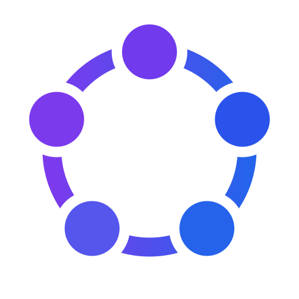
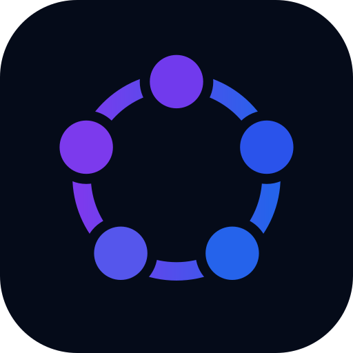

  

# Brand assets

The OpenCollab mark is **five nodes on a pentagon ring, joined by open arc
segments** — an equal-width gradient ring with a circular notch bitten out at
each node, plus five center dots. It encodes how the framework works:

- **Organization** — the ring is non-linear and decentralized; every role is
  interconnected, none is the hub.
- **Control** — authority is not fixed to one node; it flows around the ring
  (the terminal splash animates a highlight travelling node to node).
- **Emergence** — intelligence comes from the whole ring, not any single dot.

> *An Operating Theory of Organized Intelligence — organization shapes intelligence.*

## Files

All assets are self-contained SVG (inline gradient + mask, no external refs), so
they render anywhere including GitHub Markdown.

| File | What it is | Use it on |
|------|------------|-----------|
| [`mark.svg`](mark.svg) | Primary mark — gradient ring + five dots, transparent background | Anywhere; theme-safe (no dark ink) |
| [`mark-mono-black.svg`](mark-mono-black.svg) | Single-colour mark, black | Light backgrounds, one-colour print |
| [`mark-mono-gray.svg`](mark-mono-gray.svg) | Single-colour mark, gray | Muted / secondary placements |
| [`mark-mono-white.svg`](mark-mono-white.svg) | Single-colour mark, white | Dark backgrounds |
| [`lockup-horizontal.svg`](lockup-horizontal.svg) | Mark + "OpenCollab" wordmark, side by side (dark ink) | **Light** backgrounds |
| [`lockup-horizontal-tagline.svg`](lockup-horizontal-tagline.svg) | Horizontal lockup + tagline (dark ink) | **Light** backgrounds, hero placements |
| [`lockup-stacked.svg`](lockup-stacked.svg) | Mark above the wordmark (dark ink) | **Light** backgrounds, square-ish space |
| [`banner-dark.svg`](banner-dark.svg) | Mark + white wordmark on a dark rounded panel | README headers; theme-safe (own background) |
| [`app-icon.svg`](app-icon.svg) | Mark on a dark rounded square (512×512) | App / launcher icon; theme-safe |
| [`app-icon-mono.svg`](app-icon-mono.svg) | Monochrome rounded-square icon | One-colour app icon |
| [`favicon.svg`](favicon.svg) | Tightly cropped mark | Favicon / 16–32 px tabs |
| [`brand-guidelines.svg`](brand-guidelines.svg) | **Authoritative brand board** — construction, principles, colour, clear space, sizing, mono, applications | Reference / source of truth |

## Colour

| Role | Hex |
|------|-----|
| Gradient start (violet) | `#7C3AED` |
| Gradient end (blue) | `#2563EB` |
| Ink / dark surface | `#0F172A` |
| Light surface | `#E2E8F0` |

The five node dots are sampled along the gradient (`#713AED`, `#2A53EB`,
`#2563EB`, `#5556EC`, `#7C3AED`) so the ring reads as one continuous sweep.

## Usage

- **Clear space** — keep at least one node-diameter (*x*) of empty space on all
  four sides of the mark.
- **Minimum size** — the full-detail mark holds down to ~48 px. At 32 px and
  below, use the simplified / `favicon` crop.
- **Pick by background** — gradient `mark` or `banner-dark`/`app-icon` (which
  carry their own dark panel) are safe on any theme; the dark-ink lockups are
  for light backgrounds; `mark-mono-white` is for dark backgrounds.
- **Don't** — recolour the gradient, stretch or rotate the mark, add shadows or
  outlines, or place a low-contrast variant on a busy background.

  
  &nbsp;&nbsp;&nbsp;
  

## Terminal splash

The mark also renders as an animated truecolor logo in the terminal — the same
ring-and-notch construction, with the highlight flowing around the nodes to
express *Control*. It lives in the source kit as `term/oc-logo.py` (zero
dependencies): run it directly, `--once` for a single static frame (a CLI
splash), or `--cycles N` to loop.

## Source & regeneration

These files are **built products**. The source of truth is the brand board
[`brand-guidelines.svg`](brand-guidelines.svg); every single-purpose asset is
sliced from its construction (ring-width / radius ≈ 0.19, node-radius / radius ≈
0.28, notch-radius / radius ≈ 0.38). The wordmark is instantiated from SF Pro
(weight 640) and converted to paths, so the assets stay identical across
platforms.

They are generated by the **oc-logo-kit** (`scripts/generate.py`). To change the
brand, edit the kit and regenerate, then copy the refreshed SVGs back into this
directory — do not hand-edit the outputs here.
