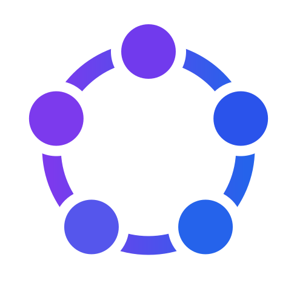
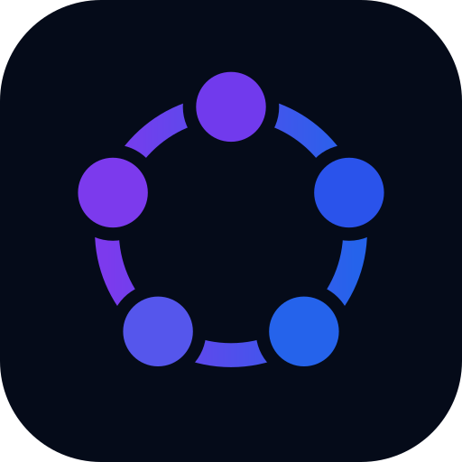

<p align="center">
  
</p>

# Brand assets

The OpenCollab mark has five nodes on a pentagon ring joined by open arc
segments. The equal-width gradient ring has a circular notch at each node and a
dot in the center of each notch.

The ring represents collaboration without a permanent central role. Its open
segments reflect control moving between roles. The full mark depicts
intelligence emerging from the organization. The lockup-with-tagline asset uses
*An Operating Theory of Organized Intelligence.* The README hero uses
*Program how coding agents collaborate. Verify that they did.*

## Files

The SVG assets contain their gradients, masks, and text paths within each file.
The brand-board template keeps its explanatory copy as editable text. The
generated brand board converts that copy to paths.

| File | What it is | Use it on |
|------|------------|-----------|
| [`mark.svg`](mark.svg) | Primary mark with a gradient ring, five dots, and a transparent background | Any theme |
| [`mark-mono-black.svg`](mark-mono-black.svg) | Single-colour mark, black | Light backgrounds, one-colour print |
| [`mark-mono-gray.svg`](mark-mono-gray.svg) | Single-colour mark, gray | Muted or secondary placements |
| [`mark-mono-white.svg`](mark-mono-white.svg) | Single-colour mark, white | Dark backgrounds |
| [`lockup-horizontal.svg`](lockup-horizontal.svg) | Mark and "OpenCollab" wordmark side by side in dark ink | **Light** backgrounds |
| [`lockup-horizontal-tagline.svg`](lockup-horizontal-tagline.svg) | Horizontal lockup and tagline in dark ink | **Light** backgrounds and hero placements |
| [`lockup-stacked.svg`](lockup-stacked.svg) | Mark above the wordmark (dark ink) | **Light** backgrounds, square-ish space |
| [`lockup-horizontal-white.svg`](lockup-horizontal-white.svg) | Horizontal lockup with the wordmark in white ink and a transparent background | **Dark** backgrounds |
| [`banner-dark.svg`](banner-dark.svg) | Mark and white wordmark on a dark rounded panel | README headers on any theme |
| [`app-icon.svg`](app-icon.svg) | Mark on a dark rounded square (512×512) | App or launcher icon on any theme |
| [`app-icon-mono.svg`](app-icon-mono.svg) | Monochrome rounded-square icon | One-colour app icon |
| [`favicon.svg`](favicon.svg) | Tightly cropped mark | Favicon / 16–32 px tabs |
| [`brand-guidelines.svg`](brand-guidelines.svg) | Authoritative brand board with construction and usage guidance | Reference |
| [`brand-guidelines.svg.in`](brand-guidelines.svg.in) | Source for mark geometry and board copy | Regeneration input only |

## Colour

| Role | Hex |
|------|-----|
| Gradient start (violet) | `#7C3AED` |
| Gradient end (blue) | `#2563EB` |
| Ink / dark surface | `#0F172A` |
| Light surface | `#E2E8F0` |

The five node dots use colors sampled along the gradient (`#713AED`, `#2A53EB`,
`#2563EB`, `#5556EC`, `#7C3AED`).

## Usage

| Requirement | Guidance |
| --- | --- |
| Clear space | Keep at least one node diameter (*x*) of empty space on all four sides of the mark. |
| Minimum size | Use the full-detail mark at about 48 px or larger. At 32 px and below, use the simplified `favicon` crop. |
| Background | The gradient `mark`, `banner-dark`, and `app-icon` work across themes. Use dark-ink lockups on light backgrounds, and `lockup-horizontal-white` or `mark-mono-white` on dark backgrounds. |
| Alterations | Keep the supplied gradient, proportions, orientation, and stroke treatment. Do not recolour, stretch, rotate, add shadows or outlines, or use a low-contrast mark on a busy background. |

<p align="center">
  
  &nbsp;&nbsp;&nbsp;
  
</p>

## Benchmark table

`benchmark-results-light.svg` and `benchmark-results-dark.svg` display the
benchmark results in a fixed-column layout. Both keep text editable and
support the corresponding GitHub color scheme. Keep the values synchronized
between the two themes when updating the results.

`benchmark-hero-light.svg` and `benchmark-hero-dark.svg` show the Pass@1 column
of the same table as bars in the README header. Update them together with the
table.

## README hero

`readme-hero-light.svg` and `readme-hero-dark.svg` place the horizontal lockup
above the README tagline on a transparent background. The light file uses the
dark-ink wordmark and the brand gradient for the second line; the dark file uses
the white wordmark and a lighter violet-to-blue gradient that stays legible on
dark themes. The tagline is SVG text in the Liberation Sans font stack.

## Terminal splash

[`opencollab/adapters/tui/brand_motion.py`](../opencollab/adapters/tui/brand_motion.py)
defines the TUI's pulsing brand dot separately from the SVG assets and their
generator.

## Source & regeneration

[`brand-guidelines.svg.in`](brand-guidelines.svg.in) contains the mark geometry
and board copy. The ring-width / radius is
about 0.19, node-radius / radius is about 0.28, and notch-radius / radius is
about 0.38. The generator preserves that geometry and produces these files.

- `banner-dark.svg`
- `lockup-horizontal.svg`
- `lockup-horizontal-tagline.svg`
- `lockup-stacked.svg`
- `brand-guidelines.svg`, including its wordmark and explanatory text paths

`lockup-horizontal-white.svg` and the two README hero files copy the mark and
wordmark paths from `lockup-horizontal.svg` and change only the wordmark fill.
Update them whenever the lockups are regenerated.

The wordmark uses **Liberation Sans 2.1.5 Bold** and the tagline uses
**Liberation Sans 2.1.5 Regular**. The inputs came from Debian package
`fonts-liberation 1:2.1.5-3`, corresponding to the upstream
[`liberation-fonts` 2.1.5 source](https://github.com/liberationfonts/liberation-fonts/tree/2.1.5).

| Input | SHA-256 |
|-------|---------|
| `LiberationSans-Bold.ttf` | `3973aa5054fb467dd5627245d3dc82e37bf16fe075756156a570455871351582` |
| `LiberationSans-Regular.ttf` | `4659bc0c58c5028dd488ec928d41d9265db43d9b669fc14ca8b0832daca7b144` |

Liberation Sans is licensed under the **SIL Open Font License 1.1**. Its
copyright notice and complete license are retained in
[`LICENSES/LiberationSans-OFL-1.1.txt`](LICENSES/LiberationSans-OFL-1.1.txt).
Generation uses the font binaries as inputs. The repository stores the
generated lockups as vector outlines and does not store the font binaries.

Regenerate with the pinned path converter.

```bash
uv run --no-project --with "fonttools==4.59.2" \
  python scripts/generate_brand_assets.py
```

The script validates family, style, version, and SHA-256 before writing. Pass
`--bold-font` and `--regular-font` when the files are installed elsewhere. Use
`--check` to verify that the tracked SVGs match the pinned inputs without
modifying them.
